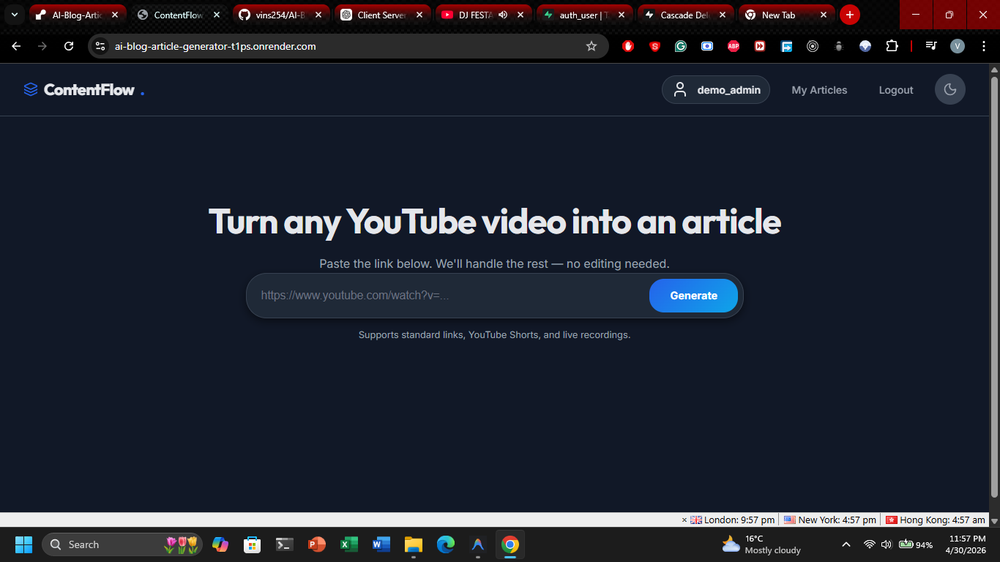
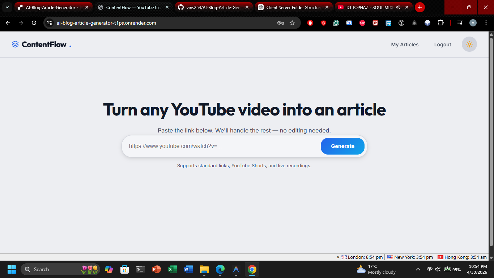
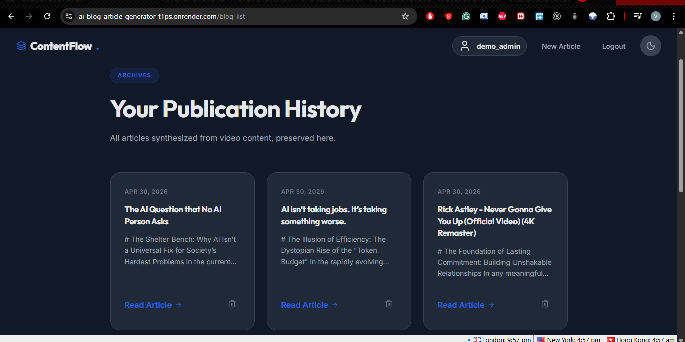

# ContentFlow — YouTube to Article Generator

> **Live Demo**: [https://ai-blog-article-generator-t1ps.onrender.com](https://ai-blog-article-generator-t1ps.onrender.com)

> **Demo Access**: 
> - **Username**: `demo_admin`
> - **Password**: `demo12345`
> (Use these credentials on the login page for instant access)

---

## What is ContentFlow?
ContentFlow is a powerful full-stack web application that transforms any YouTube video into a well-structured, professional blog post in minutes. It automates the entire content creation process—from video extraction to final editorial synthesis—allowing creators and marketers to scale their written content effortlessly.

## How It Works
The application follows a 4-stage automated pipeline:
1.  **Extraction**: The system uses `yt-dlp` to identify the video and download a high-quality audio stream.
2.  **Transcription**: The audio is processed by `AssemblyAI` (Universal-3-Pro) to convert spoken words into accurate text.
3.  **Synthesis**: An AI engine (via `OpenRouter`) analyzes the transcript and writes a professional article, removing "verbal filler" and organizing the content into logical headings.
4.  **Publication**: The final article is rendered in a beautiful, reader-friendly format and saved to your personal editorial archive.

## Tech Stack

### Backend
- **Framework**: Django (Python 3.12+)
- **Database**: PostgreSQL (Supabase)
- **Async Tasks**: Django-Q2 (ORM Broker)
- **Transcription**: AssemblyAI (Universal-3-Pro)
- **Synthesis**: OpenRouter (AI Editorial Engine)

## Screenshots

### Dashboard (Dark Mode)


### Dashboard (Light Mode)


### Article Archive


### Frontend
- **Design**: Custom Vanilla CSS (Design System)
- **Icons**: Lucide Icons
- **Responsiveness**: Fully fluid layout with Light/Dark mode support

## Getting Started

### Prerequisites
- Python 3.8+
- FFmpeg (Installed in your system PATH)
- API Keys for AssemblyAI and OpenRouter

### Installation

1. **Clone & Setup**:
   ```bash
   git clone https://github.com/vins254/AI-Blog-Article-Generator.git
   cd AI-Blog-Article-Generator/server
   python -m venv venv
   source venv/bin/activate # or venv\Scripts\activate on Windows
   pip install -r requirements.txt
   ```

2. **Environment Configuration**:
   Create a `.env` file in the `server/` directory:
   ```env
   SECRET_KEY=your_secret_key
   DEBUG=True
   ASSEMBLYAI_API_KEY=your_assemblyai_key
   OPENROUTER_API_KEY=your_openrouter_key
   ```

3. **Launch**:
   ```bash
   python manage.py migrate
   python manage.py qcluster & # Start background worker
   python manage.py runserver
   ```

## Authors
- **ContentFlow Development Team**
