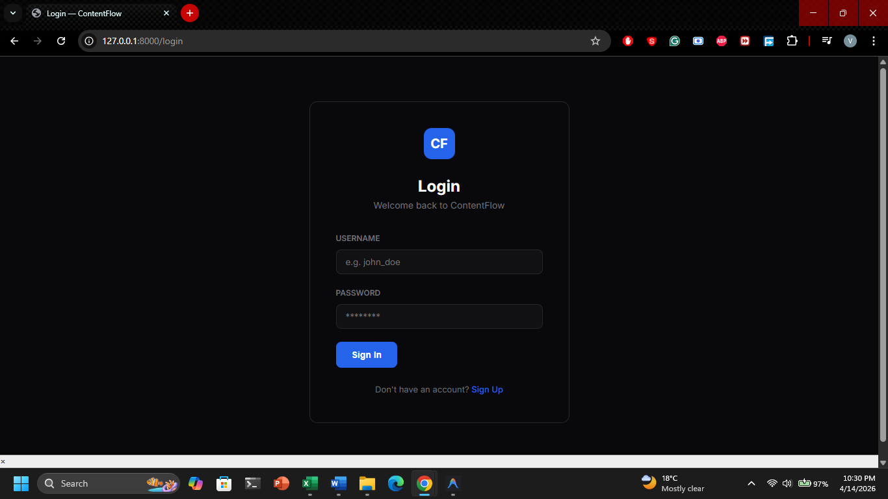
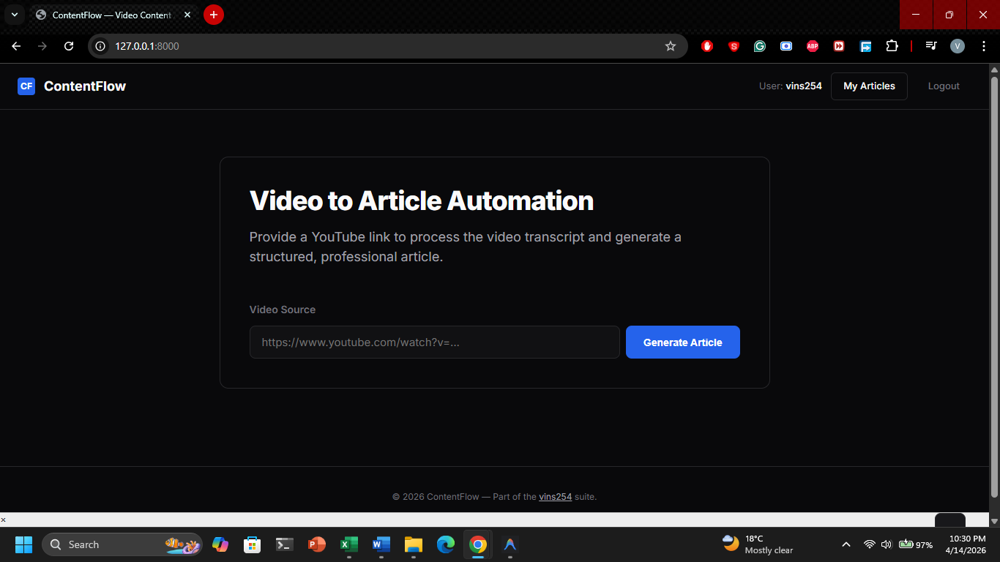
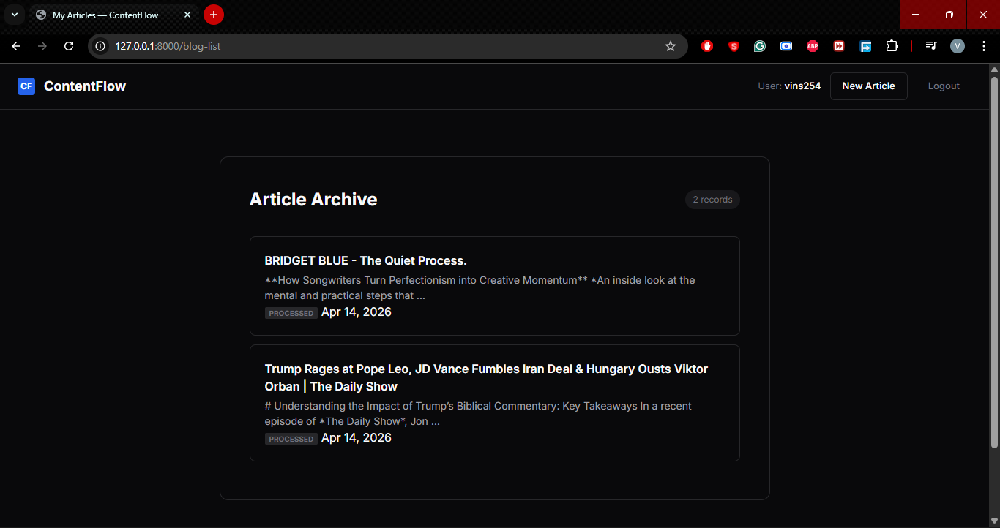
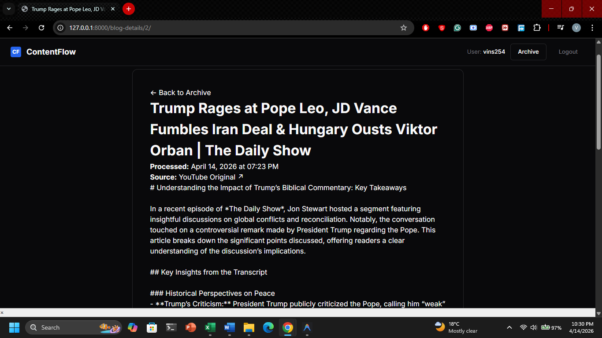
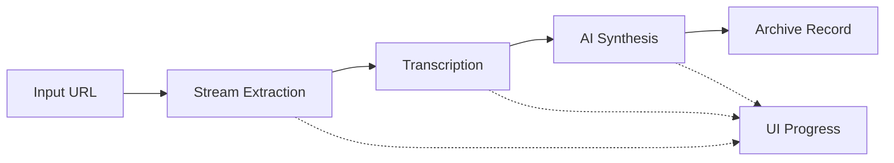

# 🌊 ContentFlow

> **State-of-the-Art Video Content Automation Suite.**
> Transform YouTube streams into professional, SEO-optimized editorial articles in real-time.


---

## 📖 Overview

ContentFlow is a high-performance content engine designed to bridge the gap between video media and written editorial content. It automates the complex pipeline of stream extraction, transcription, and contextual synthesis.

### ✨ Key Features

- 🔄 **Real-Time Streaming Pipeline** — Watch the entire process (Download → Transcribe → Synthesize) live in the UI and terminal.
- 🎥 **Video-to-Article** — Batch process YouTube content into polished archives.
- 📊 **Contextual Synthesis** — Intelligent extraction of key takeaways, subheadings, and meta-data.
- 🔐 **Hardened Security** — Full CSRF protection, secure authentication, and user-isolated content archives.
- 🎨 **SaaS Interface** — Professional, minimalist design focused on editorial clarity (Zero AI-bloat).
- 🧩 **Redundant AI Routing** — Automatically falls back to stable models (via OpenRouter) to ensure 24/7 service availability.

---

## 🖼️ Visual Tour

### 1. Secure Access

*Professional authentication interface styled with the ContentFlow SaaS theme.*

### 2. Stream Dashboard

*The main workstation where users process video links and monitor the real-time synthesis pipeline.*

### 3. Editorial Archive

*A personal repository of processed articles, sorted by date for easy content management.*

### 4. Article Preview

*The final output featuring structured headings, bold key terms, and SEO-ready meta descriptions.*

---

## 🛠️ Architecture

| Layer | Technology |
|-----------|-----------|
| **Framework** | Django 6.0 (Python) |
| **Logic Engine** | OpenRouter Auto-Router (Free Tier Fallback) |
| **Transcription** | AssemblyAI (Universal Model) |
| **Extraction** | yt-dlp + FFmpeg |
| **Streaming** | Server-Sent Progress Events (Real-time updates) |
| **UI Design** | Professional SaaS Design System |

---

## 🚀 Getting Started

### Prerequisites

- **Python 3.12+**
- **FFmpeg** — Crucial for audio processing
- **API Keys:**
  - [AssemblyAI](https://www.assemblyai.com/) — High-fidelity transcription
  - [OpenRouter](https://openrouter.ai/) — LLM Synthesis back-end

### Quick Start

1. **Clone & Env**
   ```bash
   git clone https://github.com/vins254/AI-Blog-Article-Generator.git
   cd AI-Blog-Article-Generator
   ```

2. **Environment Configuration**
   
   Create a `.env` file (UTF-8, no BOM):
   ```env
   ASSEMBLYAI_API_KEY=your_key
   OPENROUTER_API_KEY=your_key
   ```

3. **Install & Initialize**
   ```bash
   pip install -r requirements.txt
   python manage.py migrate
   python manage.py runserver
   ```

---

## 🔄 The Protocol

ContentFlow uses a streaming architecture to provide instant feedback:



1. **Extraction**: Audio data is isolated from the video stream.
2. **Transcription**: Speech-to-text conversion via premium neural models.
3. **Synthesis**: Text is restructured into a professional editorial format.
4. **Persistence**: The record is archived to your private database.

---

## 🔐 Design Philosophy

- **Professionalism**: Solid backgrounds and crisp borders. No "magical" neons or glassmorphism.
- **Transparency**: Every step of the backend process is visible in the UI loader.
- **Reliability**: Multi-model fallback logic ensures the app never hits a "404" or "Insufficient Balance" wall.

---

## 👤 Author

Developed by **vins254** — [GitHub](https://github.com/vins254)
